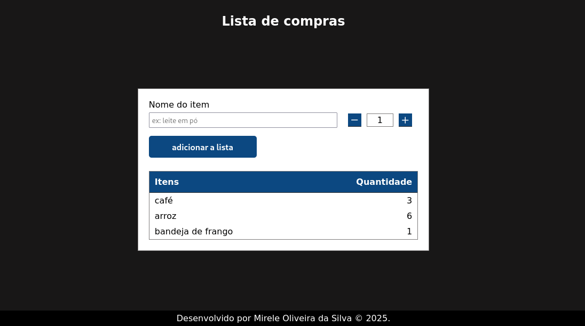

  <h1>Lista de compras</h1>
    
    
    
     
     
     
   

   

 O projeto é uma aplicação de lista de compras que permite adicionar itens e ajustar suas quantidades. Além disso a interface é resposiva sendo compatível tanto para dispositivos móveis, quanto para desktops.

  
Desenvolvido por <a target="_blank" rel="external" href="https://github.com/MegMinnie/"><strong>Mirele Oliveira da Silva</strong></a>

 

  
  ## Como Acessar a Aplicação

Acesse a aplicação por meio do link: <a href="https://megminnie.github.io/lista-de-compras/
"_blank">clique aqui</a>

## Screenshots

